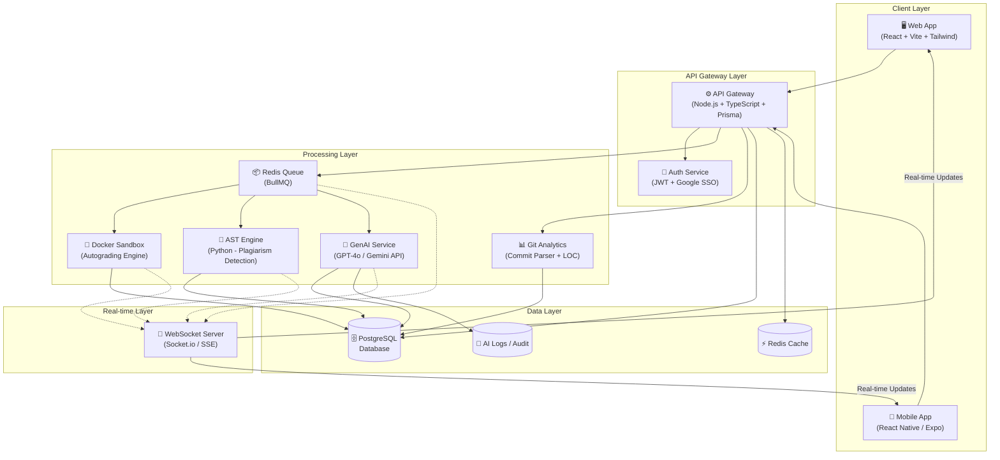
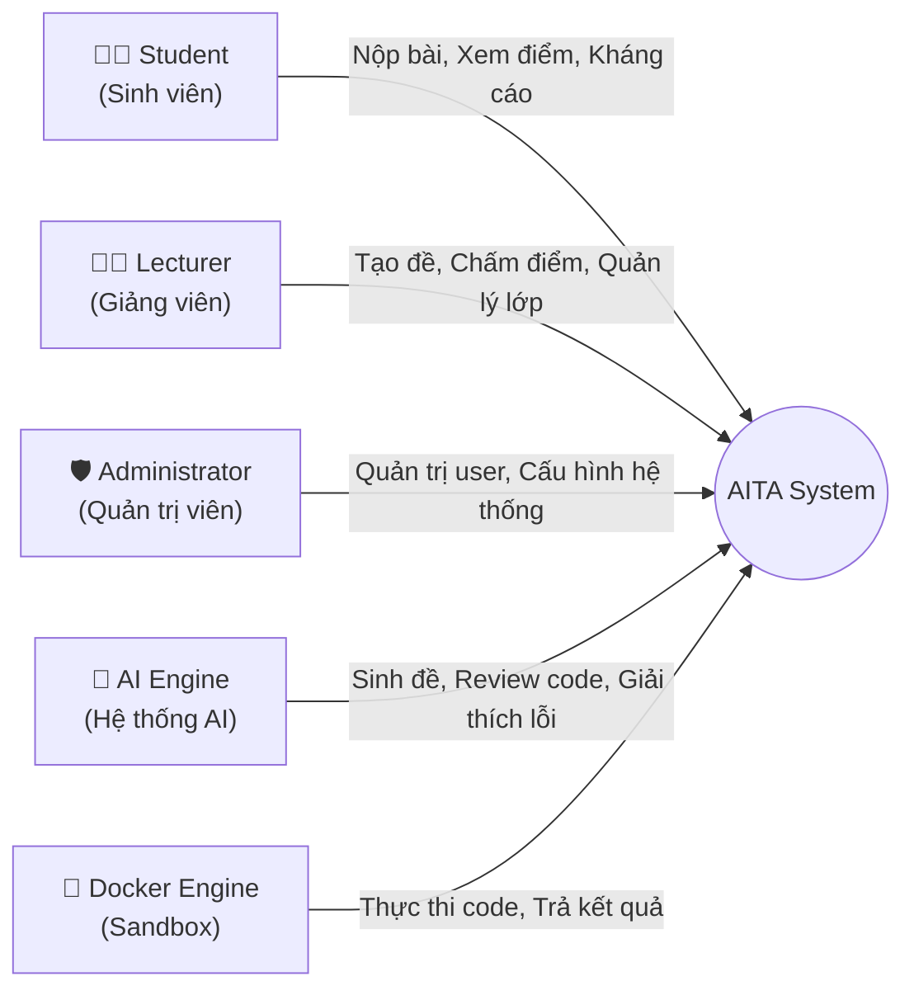
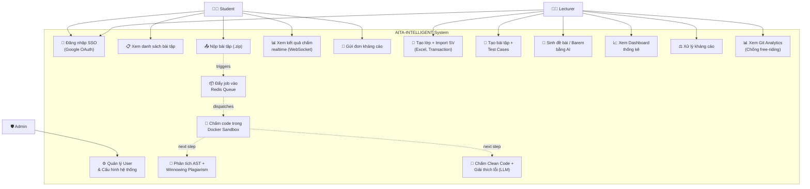
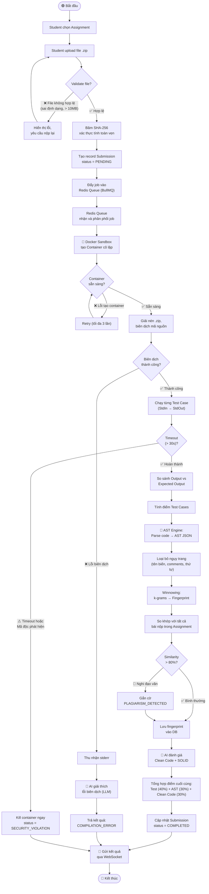
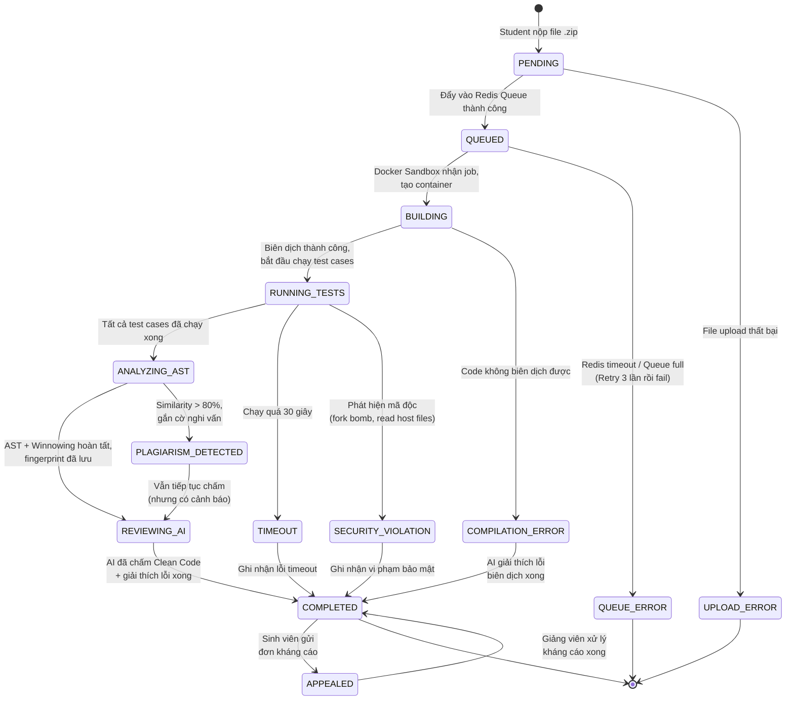
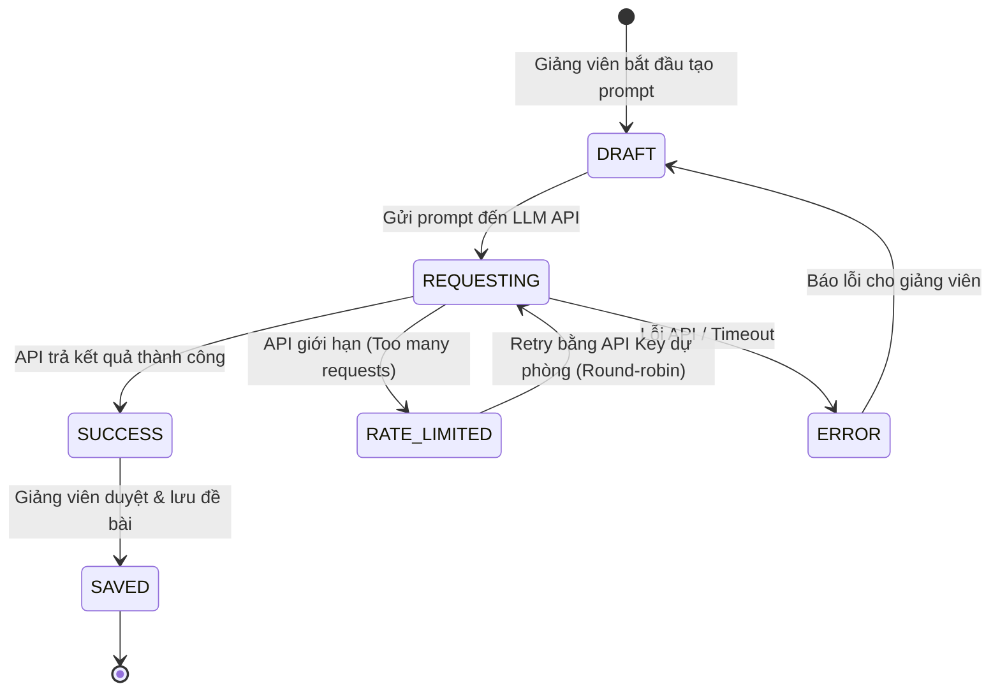
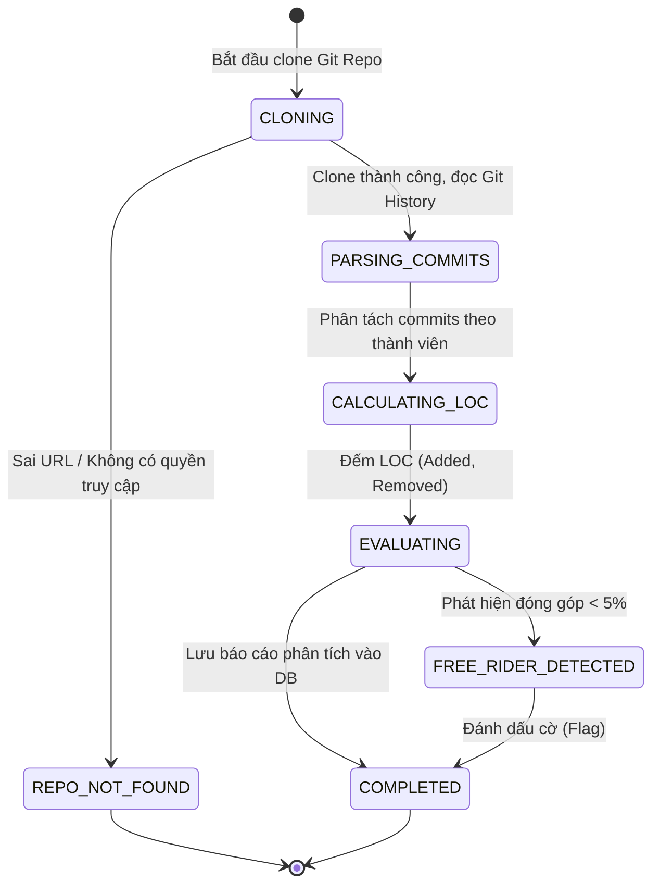
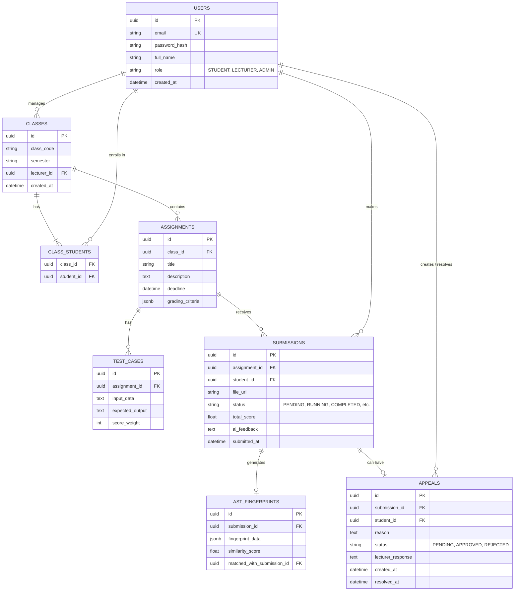

# AITA-INTELLIGENT — Software Requirements Specification (SRS)

**Phiên bản:** 1.0
**Ngày tạo:** 07/09/2026
**Nhóm phát triển:** SWP391 – Group 3
**Học kỳ:** Fall 2026 – FPT University

---

## Mục lục

1. [Giới thiệu](#1-giới-thiệu)
2. [Mô tả tổng quan hệ thống](#2-mô-tả-tổng-quan-hệ-thống)
3. [Tác nhân hệ thống (System Actors)](#3-tác-nhân-hệ-thống-system-actors)
4. [Danh sách User Stories](#4-danh-sách-user-stories)
5. [Đặc tả Use Case chi tiết](#5-đặc-tả-use-case-chi-tiết)
6. [Sơ đồ UML](#6-sơ-đồ-uml)
7. [Yêu cầu phi chức năng (Non-Functional Requirements)](#7-yêu-cầu-phi-chức-năng-non-functional-requirements)
8. [Ràng buộc hệ thống (System Constraints)](#8-ràng-buộc-hệ-thống-system-constraints)
9. [Phụ lục – Nhật ký sử dụng AI (AI Validation Logs)](#9-phụ-lục--nhật-ký-sử-dụng-ai-ai-validation-logs)

---

## 1. Giới thiệu

### 1.1. Mục đích tài liệu (Purpose)
Tài liệu Đặc tả Yêu cầu Phần mềm (SRS) này mô tả toàn bộ yêu cầu chức năng và phi chức năng của hệ thống **AITA-Intelligent** (AI-Powered Teaching Assistant & AST Code Analytics Platform). Tài liệu phục vụ làm cơ sở cho việc thiết kế, phát triển, kiểm thử và nghiệm thu sản phẩm phần mềm trong khuôn khổ học phần SWP391 – Dự án Phát triển Phần mềm.

### 1.2. Phạm vi dự án (Scope)
AITA-Intelligent là một nền tảng hỗ trợ giảng dạy lập trình thông minh, bao gồm:
- **Cổng thông tin Web & Mobile** cho sinh viên và giảng viên (Portal & Auth).
- **Hệ thống chấm điểm mã nguồn tự động** trong môi trường Docker cô lập (Autograding Sandbox).
- **Module tích hợp AI tạo sinh** (GenAI) hỗ trợ soạn đề, chấm điểm Clean Code và giải thích lỗi biên dịch.
- **Công cụ phát hiện đạo văn mã nguồn** dựa trên phân tích Cây cú pháp trừu tượng (AST) kết hợp thuật toán Winnowing.
- **Hệ thống hàng đợi nền** (Redis Queue) và phân tích đóng góp nhóm bằng Git Analytics.

### 1.3. Đối tượng sử dụng tài liệu (Intended Audience)
| Đối tượng | Mục đích sử dụng |
|---|---|
| Giảng viên hướng dẫn (Instructor) | Đánh giá, nghiệm thu sản phẩm |
| Nhóm phát triển (Dev Team) | Tham chiếu khi thiết kế, lập trình |
| Nhóm đánh giá chéo P2P (Peer Reviewers) | Kiểm tra tính đầy đủ của yêu cầu |
| Hội đồng bảo vệ (Defense Committee) | Đánh giá cuối kỳ |

### 1.4. Thuật ngữ và Từ viết tắt (Glossary)
| Thuật ngữ | Định nghĩa |
|---|---|
| **AST** | Abstract Syntax Tree – Cây cú pháp trừu tượng, biểu diễn cấu trúc logic của mã nguồn |
| **Winnowing** | Thuật toán tạo vân tay số (fingerprint) từ chuỗi k-grams để so khớp văn bản/mã nguồn |
| **Sandbox** | Môi trường thực thi mã nguồn cô lập (Docker Container) với tài nguyên giới hạn |
| **JWT** | JSON Web Token – Chuẩn xác thực stateless |
| **SSO** | Single Sign-On – Đăng nhập một lần qua Google OAuth 2.0 |
| **BullMQ** | Thư viện hàng đợi (queue) dựa trên Redis cho Node.js |
| **LLM** | Large Language Model – Mô hình ngôn ngữ lớn (GPT-4o, Gemini) |
| **ERD** | Entity-Relationship Diagram – Sơ đồ quan hệ thực thể |
| **SRS** | Software Requirements Specification – Tài liệu đặc tả yêu cầu phần mềm |
| **P2P** | Peer-to-Peer – Đánh giá ngang hàng giữa các nhóm |
| **UAT** | User Acceptance Testing – Kiểm thử chấp nhận người dùng |
| **CI/CD** | Continuous Integration / Continuous Deployment |
| **LOC** | Lines of Code – Số dòng mã nguồn |
| **k-gram** | Chuỗi con liên tiếp gồm k phần tử, dùng trong thuật toán Winnowing |
| **Fingerprint** | Vân tay số – Tập hợp các giá trị băm đại diện cho một tài liệu/mã nguồn |

### 1.5. Tài liệu tham chiếu (References)
1. Schleimer, S., Wilkerson, D.S., Aiken, A. (2003). *"Winnowing: Local Algorithms for Document Fingerprinting"*. ACM SIGMOD 2003.
2. Parr, T. (2010). *"Language Implementation Patterns"*. Pragmatic Bookshelf.
3. Sommerville, I. (2016). *"Software Engineering"*, 10th Edition. Pearson.
4. Docker Engine API Documentation – https://docs.docker.com/engine/api/
5. OpenAI API Reference – https://platform.openai.com/docs/api-reference

---

## 2. Mô tả tổng quan hệ thống

### 2.1. Bối cảnh sản phẩm (Product Context)
Hệ thống AITA-Intelligent giải quyết các bài toán thực tế trong giảng dạy lập trình tại các trường đại học:
- **Chấm bài thủ công tốn thời gian:** Giảng viên mất hàng giờ để chấm điểm code cho lớp đông. AITA tự động hóa quy trình này bằng Docker Sandbox.
- **Gian lận mã nguồn tinh vi:** Sinh viên sử dụng AI (ChatGPT, Copilot) để viết bài rồi ngụy trang (đổi tên biến, đảo thứ tự hàm). Các công cụ so sánh text truyền thống bất lực. AITA dùng AST + Winnowing để phát hiện.
- **Thiếu phản hồi chất lượng:** Sinh viên chỉ biết điểm số mà không hiểu tại sao sai. AITA tích hợp LLM để giải thích lỗi bằng ngôn ngữ tự nhiên.

### 2.2. Kiến trúc tổng quan (High-Level Architecture)

### 2.3. Các phân hệ cốt lõi (Core Subsystems)
| # | Phân hệ | Mô tả | Công nghệ chính |
|---|---|---|---|
| 1 | Portal & Auth | Giao diện người dùng, xác thực, phân quyền | React, Vite, Tailwind, JWT, Google OAuth 2.0 |
| 2 | Docker Autograding Sandbox | Chấm code tự động trong container cô lập | Docker Engine API, Node.js |
| 3 | GenAI Core & Review Hub | Sinh đề, chấm Clean Code, giải thích lỗi | OpenAI GPT-4o / Gemini API, LangChain |
| 4 | AST Plagiarism Detection | Phát hiện đạo văn mã nguồn bằng AST + Winnowing | Python `ast` module, FastAPI |
| 5 | Redis Queue & Git Analytics | Hàng đợi xử lý nền, phân tích đóng góp nhóm | BullMQ, Redis, Git CLI Parser |

---

## 3. Tác nhân hệ thống (System Actors)

### 3.1. Sơ đồ tác nhân

### 3.2. Mô tả chi tiết từng tác nhân

| Tác nhân | Vai trò | Quyền hạn chính |
|---|---|---|
| **Student** | Sinh viên sử dụng hệ thống để nộp bài, xem kết quả chấm điểm và kháng cáo nếu không đồng ý với kết quả | Đăng nhập SSO (@fpt.edu.vn), xem danh sách bài tập, nộp file .zip, xem kết quả realtime, gửi đơn kháng cáo |
| **Lecturer** | Giảng viên tạo lớp học, soạn đề thi, quản lý barem chấm điểm, giám sát kết quả và xử lý khiếu nại | Tạo/sửa/xóa lớp học, import danh sách SV từ Excel, tạo bài tập + test cases, yêu cầu AI sinh đề/barem, xem báo cáo thống kê, xử lý kháng cáo, xem Git Analytics |
| **Administrator** | Quản trị viên hệ thống quản lý tài khoản, cấu hình Docker và giám sát hoạt động hệ thống | Quản lý user, cấu hình Sandbox (RAM, CPU limits), quản lý API keys (OpenAI/Gemini), xem audit logs |
| **AI Engine** | Tác nhân hệ thống tự động – Không phải con người. Thực hiện các tác vụ sinh nội dung và đánh giá chất lượng code | Sinh đề bài từ mô tả của GV, sinh barem/rubric, đánh giá Clean Code (SOLID, naming, architecture), giải thích lỗi biên dịch bằng ngôn ngữ tự nhiên |
| **Docker Engine** | Tác nhân hệ thống tự động. Là runtime cô lập thực thi mã nguồn sinh viên nộp | Tạo/hủy container, giới hạn tài nguyên (512MB RAM, CPU shares), ngắt mạng ngoài, thu nhận stdout/stderr, enforce timeout |

---

## 4. Danh sách User Stories

### 4.1. Nhóm chức năng: Sinh viên (Student)

| ID | User Story | Acceptance Criteria | Priority |
|---|---|---|---|
| **US-01** | Là một **sinh viên**, tôi muốn **đăng nhập vào hệ thống bằng tài khoản Google FPT** (`@fpt.edu.vn` / `@fe.edu.vn`) để tôi không cần tạo tài khoản mới và đảm bảo danh tính xác thực. | - Chỉ chấp nhận email miền FPT - Redirect về Dashboard sau khi đăng nhập - JWT lưu trong HttpOnly Cookie | 🔴 Cao |
| **US-02** | Là một **sinh viên**, tôi muốn **xem danh sách các bài tập (Assignments)** của lớp mình đang tham gia, để biết deadline và trạng thái nộp bài. | - Hiển thị tên bài, deadline, trạng thái (Chưa nộp / Đã nộp / Đã chấm) - Sắp xếp theo deadline gần nhất | 🔴 Cao |
| **US-03** | Là một **sinh viên**, tôi muốn **nộp bài tập dưới dạng file .zip** chứa mã nguồn, để hệ thống tự động chấm điểm cho tôi. | - Chỉ chấp nhận file .zip (tối đa 10MB) - File được băm SHA-256 để xác thực tính toàn vẹn - Hệ thống hiển thị trạng thái "Đã nhận bài" ngay lập tức | 🔴 Cao |
| **US-04** | Là một **sinh viên**, tôi muốn **xem kết quả chấm điểm realtime** (điểm test cases, điểm Clean Code, kết quả kiểm tra đạo văn) ngay khi hệ thống xử lý xong, mà không cần reload trang. | - Cập nhật realtime qua WebSocket - Hiển thị rõ: Passed/Failed cho từng test case - Hiển thị điểm Clean Code kèm giải thích từ AI - Hiển thị phần trăm tương đồng đạo văn (nếu > 30% thì cảnh báo đỏ) | 🔴 Cao |
| **US-05** | Là một **sinh viên**, tôi muốn **gửi đơn kháng cáo (Appeal)** nếu tôi cho rằng kết quả chấm điểm tự động không chính xác, để giảng viên xem xét lại. | - Form kháng cáo có trường "Lý do" (textarea) - Trạng thái kháng cáo: Đang chờ / Đã chấp nhận / Đã từ chối - Sinh viên nhận thông báo khi GV phản hồi | 🟡 Trung bình |

### 4.2. Nhóm chức năng: Giảng viên (Lecturer)

| ID | User Story | Acceptance Criteria | Priority |
|---|---|---|---|
| **US-06** | Là một **giảng viên**, tôi muốn **tạo lớp học mới và import danh sách sinh viên từ file Excel**, để tiết kiệm thời gian nhập liệu thủ công. | - Upload file .xlsx, hệ thống tự parse cột: Mã SV, Họ tên, Email - Sử dụng DB Transaction để đảm bảo import toàn bộ hoặc rollback nếu lỗi - Báo cáo số lượng import thành công/thất bại | 🔴 Cao |
| **US-07** | Là một **giảng viên**, tôi muốn **tạo bài tập (Assignment) kèm bộ test cases** (dạng StdIn/StdOut), để hệ thống có thể chấm điểm tự động cho sinh viên. | - Nhập tiêu đề, mô tả, deadline - Thêm nhiều test case (mỗi test case gồm: Input, Expected Output, điểm số) - Chọn ngôn ngữ lập trình cho Sandbox (Java, Python, C#) | 🔴 Cao |
| **US-08** | Là một **giảng viên**, tôi muốn **yêu cầu AI tự động sinh đề bài và barem điểm** từ mô tả ngắn gọn của tôi, để giảm thời gian soạn đề. | - GV nhập prompt mô tả chủ đề (ví dụ: "Bài tập về linked list") - AI trả về: đề bài hoàn chỉnh, input/output mẫu, rubric chấm điểm - GV có thể chỉnh sửa trước khi lưu | 🟡 Trung bình |
| **US-09** | Là một **giảng viên**, tôi muốn **xem Dashboard thống kê tổng quan** (tỷ lệ nộp bài, phân bố điểm, danh sách nghi vấn đạo văn) cho mỗi bài tập, để nắm bắt tình hình lớp nhanh chóng. | - Biểu đồ tròn: tỷ lệ nộp bài - Biểu đồ cột: phân bố điểm - Bảng: Top 10 cặp bài nộp có % tương đồng cao nhất (AST Plagiarism) | 🔴 Cao |
| **US-10** | Là một **giảng viên**, tôi muốn **xử lý đơn kháng cáo của sinh viên** (Chấp nhận hoặc Từ chối kèm lý do), để đảm bảo sự công bằng trong chấm điểm. | - Danh sách kháng cáo Pending - Xem lại code + kết quả chấm gốc - Nút Accept (chấm lại) hoặc Reject (kèm lý do) | 🟡 Trung bình |
| **US-11** | Là một **giảng viên**, tôi muốn **xem báo cáo đóng góp Git Analytics** của từng thành viên trong nhóm (commits, LOC, PRs), để đánh giá mức độ đóng góp cá nhân và phát hiện free-riding. | - Nhập URL GitHub Repo của nhóm - Hiển thị: Tổng commits, LOC added/removed, số PR merged, biểu đồ đóng góp theo thời gian - Cảnh báo đỏ nếu thành viên đóng góp < 5% | 🟡 Trung bình |

### 4.3. Nhóm chức năng: Hệ thống tự động (System / AI / Docker)

| ID | User Story | Acceptance Criteria | Priority |
|---|---|---|---|
| **US-12** | Là **hệ thống**, khi nhận được file .zip bài nộp, tôi phải **đưa bài nộp vào hàng đợi Redis (BullMQ)** để xử lý không đồng bộ, tránh block luồng chính của API. | - Bài nộp được enqueue với metadata: submissionId, studentId, language - Queue có cơ chế retry (tối đa 3 lần) nếu job thất bại - API trả về ngay status 202 Accepted | 🔴 Cao |
| **US-13** | Là **hệ thống Docker Sandbox**, khi nhận job từ Redis Queue, tôi phải **tạo container cô lập** với giới hạn: 512MB RAM, CPU shares giới hạn, **ngắt hoàn toàn kết nối mạng**, biên dịch và chạy code sinh viên với bộ test cases, rồi trả kết quả. | - Container tự hủy sau khi chạy xong hoặc sau timeout (30 giây) - Không cho phép: fork bomb, đọc file host, ghi file vượt quota - Trả kết quả: Passed/Failed cho mỗi test case + stdout/stderr | 🔴 Cao |
| **US-14** | Là **hệ thống AST Engine**, sau khi Docker chấm xong, tôi phải **chuyển mã nguồn thành cây AST, loại bỏ ngụy trang bề mặt** (tên biến, comments, thứ tự hàm), **áp dụng Winnowing** để tạo fingerprint, và **so khớp với toàn bộ bài nộp khác** trong cùng assignment để tính % tương đồng. | - Hỗ trợ parse: Python (module `ast`), C# (Roslyn), Java (ANTLR) - Loại bỏ: tên biến, tên hàm, comments, whitespace, thứ tự hàm - Winnowing: chọn k-gram size = 25, window size = 40 - Lưu fingerprint vào bảng `ASTFingerprints` - Tạo Similarity Matrix: mọi cặp bài nộp | 🔴 Cao |
| **US-15** | Là **hệ thống AI (LLM)**, sau khi Docker chấm xong, tôi phải **đánh giá chất lượng mã nguồn** (Clean Code, SOLID, naming convention, kiến trúc layer) và **giải thích lỗi biên dịch bằng ngôn ngữ tự nhiên tiếng Việt** để sinh viên hiểu. | - Sử dụng API GPT-4o hoặc Gemini (xoay vòng key) - Prompt Chain-of-Thought + Few-Shot Learning - Trả về: điểm Clean Code (0-100), danh sách nhận xét cụ thể từng file, giải thích lỗi biên dịch nếu có - Timeout: tối đa 60 giây/request | 🟡 Trung bình |

---

## 5. Đặc tả Use Case chi tiết

### UC-01: Sinh viên nộp bài tập (Submit Assignment)
| Thuộc tính | Mô tả |
|---|---|
| **Tác nhân chính** | Student |
| **Tác nhân phụ** | Docker Sandbox, AST Engine, AI Engine |
| **Điều kiện tiên quyết** | Student đã đăng nhập, Assignment chưa hết deadline |
| **Kịch bản chính (Main Flow)** | 1. Student chọn Assignment từ danh sách 2. Student upload file `.zip` chứa mã nguồn 3. Hệ thống validate file (kiểm tra dung lượng ≤ 10MB, định dạng .zip) 4. Hệ thống băm SHA-256 file để xác thực tính toàn vẹn 5. Hệ thống tạo record `Submission` với trạng thái `PENDING` 6. Hệ thống đẩy job vào Redis Queue (BullMQ) 7. Redis Queue chuyển job cho Docker Sandbox 8. Docker Sandbox tạo container cô lập, biên dịch và chạy test cases 9. Docker trả kết quả test → Hệ thống cập nhật trạng thái `GRADING` 10. AST Engine parse mã nguồn, tạo fingerprint, so khớp đạo văn 11. AI Engine đánh giá Clean Code + giải thích lỗi 12. Hệ thống tổng hợp điểm, cập nhật trạng thái `COMPLETED` 13. Gửi kết quả realtime cho Student qua WebSocket |
| **Kịch bản thay thế (Alternative Flow)** | **4a.** File bị corrupt hoặc vượt dung lượng → Báo lỗi, yêu cầu nộp lại **8a.** Code sinh viên chứa mã độc (fork bomb) → Docker kill container sau timeout 30s → Trạng thái `SECURITY_VIOLATION` **8b.** Code không biên dịch được → Trả lỗi compilation + AI giải thích lỗi **10a.** Phát hiện % tương đồng > 80% → Gắn cờ `PLAGIARISM_DETECTED`, thông báo giảng viên |
| **Kịch bản ngoại lệ (Exception Flow)** | **7a.** Redis Queue đầy hoặc bị down → Hệ thống retry 3 lần, nếu vẫn fail → Trạng thái `QUEUE_ERROR`, thông báo Admin **11a.** API OpenAI/Gemini timeout → Bỏ qua điểm Clean Code, chấm dựa trên test cases + AST, đánh dấu "AI Review Pending" |
| **Hậu điều kiện** | Record `Submission` được cập nhật trạng thái cuối cùng và điểm số. Student nhận kết quả trên giao diện. |

---

### UC-02: Giảng viên tạo bài tập và sinh đề bằng AI (Create Assignment with AI)
| Thuộc tính | Mô tả |
|---|---|
| **Tác nhân chính** | Lecturer |
| **Tác nhân phụ** | AI Engine |
| **Điều kiện tiên quyết** | Lecturer đã đăng nhập, đã tạo ít nhất 1 lớp học (Class) |
| **Kịch bản chính (Main Flow)** | 1. Lecturer chọn lớp học và nhấn "Tạo bài tập mới" 2. Lecturer nhập: Tiêu đề, Mô tả chung, Ngôn ngữ lập trình, Deadline 3. (Tùy chọn) Lecturer nhấn "Sinh đề bằng AI": nhập prompt mô tả chủ đề 4. AI Engine trả về: Đề bài chi tiết, Input/Output mẫu, Rubric chấm điểm 5. Lecturer review, chỉnh sửa nội dung AI sinh ra 6. Lecturer thêm bộ Test Cases (StdIn → Expected StdOut) thủ công hoặc từ AI 7. Lecturer nhấn "Lưu và Publish" 8. Hệ thống tạo record Assignment, gửi thông báo đến tất cả sinh viên trong lớp |
| **Kịch bản thay thế (Alternative Flow)** | **3a.** Lecturer không dùng AI → Tự nhập đề bài hoàn toàn thủ công **4a.** AI trả về kết quả không phù hợp → Lecturer nhấn "Sinh lại" (regenerate) với prompt khác **6a.** Test cases không hợp lệ (Expected Output trống) → Hệ thống cảnh báo và yêu cầu sửa |
| **Hậu điều kiện** | Assignment được tạo và hiển thị trong danh sách bài tập của lớp. |

---

### UC-03: Giảng viên import danh sách sinh viên (Bulk Import Students)
| Thuộc tính | Mô tả |
|---|---|
| **Tác nhân chính** | Lecturer |
| **Điều kiện tiên quyết** | Lecturer đã tạo lớp học, có file Excel đúng định dạng |
| **Kịch bản chính (Main Flow)** | 1. Lecturer chọn lớp học, nhấn "Import sinh viên" 2. Lecturer upload file `.xlsx` 3. Hệ thống parse file, trích xuất: Mã SV, Họ tên, Email 4. Hệ thống hiển thị preview danh sách (cho GV kiểm tra) 5. Lecturer nhấn "Xác nhận Import" 6. Hệ thống dùng **SQL Transaction** để insert toàn bộ sinh viên 7. Hiển thị kết quả: X sinh viên thành công, Y bản ghi trùng lặp |
| **Kịch bản thay thế (Alternative Flow)** | **3a.** File Excel sai định dạng (thiếu cột) → Báo lỗi chi tiết, yêu cầu upload lại **6a.** Transaction fail (ví dụ: trùng email) → Rollback toàn bộ, báo lỗi cụ thể dòng nào bị trùng |
| **Hậu điều kiện** | Danh sách sinh viên được thêm vào lớp. Các tài khoản mới được tạo (nếu chưa có). |

---

## 6. Sơ đồ UML

### 6.1. Sơ đồ Use Case tổng quát (Use Case Diagram)

### 6.2. Sơ đồ Activity – Luồng nộp bài và chấm điểm tự động

### 6.3. Các sơ đồ State (Trạng thái)

#### 6.3.1. Vòng đời bài nộp (Submission Lifecycle)

#### 6.3.2. Vòng đời Request GenAI (GenAI Lifecycle)

#### 6.3.3. Vòng đời phân tích Git (Git Analytics Process)

### 6.4. Sơ đồ ERD (Entity-Relationship Diagram)

### 6.5. Data Dictionary (Từ điển dữ liệu)

| Bảng (Table) | Cột (Column) | Kiểu dữ liệu | Ràng buộc (Constraints) | Mô tả |
|---|---|---|---|---|
| **USERS** | `id` | UUID | PK | Khóa chính, định danh người dùng |
| | `email` | VARCHAR(255) | UNIQUE, NOT NULL | Email FPT để đăng nhập |
| | `password_hash` | VARCHAR(255) | | Mật khẩu (nếu dùng đăng nhập truyền thống) |
| | `full_name` | VARCHAR(100) | NOT NULL | Họ tên đầy đủ |
| | `role` | ENUM | NOT NULL | Vai trò: STUDENT, LECTURER, ADMIN |
| **CLASSES** | `id` | UUID | PK | Khóa chính lớp học |
| | `class_code` | VARCHAR(50) | NOT NULL | Mã lớp (VD: SE1801) |
| | `lecturer_id` | UUID | FK -> USERS(id) | Giảng viên phụ trách lớp |
| **CLASS_STUDENTS**| `class_id` | UUID | FK -> CLASSES(id) | Khóa ngoại lớp học |
| | `student_id` | UUID | FK -> USERS(id) | Khóa ngoại sinh viên |
| **ASSIGNMENTS** | `id` | UUID | PK | Khóa chính bài tập |
| | `class_id` | UUID | FK -> CLASSES(id) | Khóa ngoại lớp học |
| | `title` | VARCHAR(255) | NOT NULL | Tiêu đề bài tập |
| | `deadline` | TIMESTAMP | NOT NULL | Hạn chót nộp bài |
| | `grading_criteria`| JSONB | | Tiêu chí chấm điểm do AI tạo |
| **TEST_CASES** | `id` | UUID | PK | Khóa chính test case |
| | `assignment_id` | UUID | FK -> ASSIGNMENTS(id)| Thuộc bài tập nào |
| | `input_data` | TEXT | | Đầu vào (StdIn) |
| | `expected_output`| TEXT | | Đầu ra mong đợi (StdOut) |
| | `score_weight` | INT | NOT NULL | Trọng số điểm |
| **SUBMISSIONS** | `id` | UUID | PK | Khóa chính bài nộp |
| | `student_id` | UUID | FK -> USERS(id) | Người nộp bài |
| | `file_url` | VARCHAR(255) | NOT NULL | Link file .zip (S3/Local) |
| | `status` | ENUM | NOT NULL | Trạng thái (PENDING, QUEUED, COMPLETED...) |
| | `total_score` | FLOAT | | Tổng điểm |
| | `ai_feedback` | TEXT | | Đánh giá Clean Code từ AI |
| **AST_FINGERPRINTS**| `id` | UUID | PK | Khóa chính chữ ký AST |
| | `submission_id` | UUID | FK -> SUBMISSIONS(id)| Chữ ký của bài nộp nào |
| | `fingerprint_data`| JSONB | NOT NULL | Mảng k-grams băm (Winnowing) |
| | `similarity_score`| FLOAT | | % Trùng lặp cao nhất |
| **APPEALS** | `id` | UUID | PK | Khóa chính đơn phúc khảo |
| | `submission_id` | UUID | FK -> SUBMISSIONS(id)| Kháng cáo bài nộp nào |
| | `reason` | TEXT | NOT NULL | Lý do sinh viên kháng cáo |
| | `status` | ENUM | DEFAULT 'PENDING' | Trạng thái (PENDING, APPROVED, REJECTED) |
| | `lecturer_response`| TEXT | | Phản hồi của giảng viên |

---

## 7. Yêu cầu phi chức năng (Non-Functional Requirements)

### 7.1. Bảo mật (Security)

| ID | Yêu cầu | Tiêu chí đo lường |
|---|---|---|
| **NFR-01** | Docker Sandbox phải cô lập hoàn toàn tài nguyên | RAM ≤ 512MB, CPU shares giới hạn, **mạng ngoài bị ngắt 100%** |
| **NFR-02** | Sandbox phải chống được mã độc phổ biến | Chặn: fork bomb, symlink escape, /proc mount, disk exhaustion |
| **NFR-03** | Xác thực JWT phải được lưu trong HttpOnly Cookie | Cookie không thể truy cập từ JavaScript (chống XSS) |
| **NFR-04** | Google SSO chỉ chấp nhận miền email FPT | Whitelist: `@fpt.edu.vn`, `@fe.edu.vn` |
| **NFR-05** | API keys (OpenAI, Gemini) không được hard-code | Lưu trong biến môi trường (.env), không commit lên Git |
| **NFR-18** | **(P2P Defense)** Hệ thống ghi log chi tiết mọi lần chạy Sandbox | Log bao gồm: `submission_id`, `start_time`, `end_time`, `exit_code`, `resource_usage` (RAM/CPU peak), `security_alert`. Lưu tối thiểu 30 ngày. |

### 7.2. Hiệu năng (Performance)

| ID | Yêu cầu | Tiêu chí đo lường |
|---|---|---|
| **NFR-06** | Thời gian phản hồi API trung bình | ≤ 200ms cho các API thông thường (CRUD) |
| **NFR-07** | Thời gian chấm điểm 1 bài nộp (end-to-end) | ≤ 90 giây (bao gồm: Docker + AST + AI) |
| **NFR-08** | Hệ thống phải chịu tải đồng thời | ≥ 100 requests/phút (stress test bằng k6 hoặc JMeter) |
| **NFR-09** | Kết quả chấm phải cache | Cache Redis cho API kết quả, TTL = 5 phút, response ≤ 100ms |

### 7.3. Khả năng mở rộng (Scalability)

| ID | Yêu cầu | Tiêu chí đo lường |
|---|---|---|
| **NFR-10** | Redis Queue phải hỗ trợ batch grading | Xử lý ≥ 50 bài nộp đồng thời mà không block API gateway |
| **NFR-11** | Hệ thống phải hỗ trợ thêm ngôn ngữ lập trình mới | Chỉ cần thêm 1 Dockerfile mới vào thư mục `docker-templates/` |

### 7.4. Độ tin cậy (Reliability)

| ID | Yêu cầu | Tiêu chí đo lường |
|---|---|---|
| **NFR-12** | Bulk import sinh viên phải dùng DB Transaction | Import thành công toàn bộ HOẶC rollback hoàn toàn (ACID) |
| **NFR-13** | Redis Queue phải có cơ chế retry | Retry tối đa 3 lần với exponential backoff |
| **NFR-14** | Docker container phải tự hủy sau khi xong | Không để container zombie tồn tại trên server |

### 7.5. Khả năng sử dụng (Usability)

| ID | Yêu cầu | Tiêu chí đo lường |
|---|---|---|
| **NFR-15** | Giao diện responsive trên cả Web và Mobile | Hỗ trợ: Desktop (≥ 1024px), Tablet (≥ 768px), Mobile (≥ 375px) |
| **NFR-16** | Cập nhật kết quả realtime không cần reload | Sử dụng WebSocket (Socket.IO) |
| **NFR-17** | Giải thích lỗi biên dịch bằng tiếng Việt | AI trả về giải thích bằng ngôn ngữ tự nhiên tiếng Việt |

---

## 8. Ràng buộc hệ thống (System Constraints)

### 8.1. Ràng buộc công nghệ
- **Frontend Web:** React 18+ với Vite, TailwindCSS
- **Frontend Mobile:** React Native / Expo
- **Backend:** Node.js 20+ với TypeScript, Prisma ORM
- **AST Engine:** Python 3.11+ với FastAPI
- **Database:** PostgreSQL 15+
- **Message Queue:** Redis 7+ với BullMQ
- **Container Runtime:** Docker Engine 24+
- **CI/CD:** GitHub Actions
- **Cloud Deploy:** Azure / AWS / Vercel (tùy nhóm chọn)

### 8.2. Ràng buộc nghiệp vụ
- Hệ thống chỉ phục vụ sinh viên và giảng viên thuộc FPT University (kiểm tra bằng email domain).
- Mỗi bài nộp chỉ được phép tối đa 10MB (file .zip).
- Thời gian thực thi code tối đa 30 giây/bài nộp.
- API key OpenAI/Gemini sử dụng cơ chế xoay vòng (round-robin) để tránh rate limit.

### 8.3. Ràng buộc dự án
- Thời gian phát triển: 10 tuần.
- Nhóm phát triển: 4-6 sinh viên.
- Code phải đạt linting (ESLint/Prettier cho TypeScript, Flake8 cho Python).
- Unit Test coverage ≥ 80% trên các module cốt lõi (yêu cầu từ Milestone 3).

---

## 9. Phụ lục – Nhật ký sử dụng AI (AI Validation Logs)

> **Hướng dẫn:** Nhóm phát triển ghi lại tất cả các lần sử dụng AI (ChatGPT, Gemini, Copilot...) trong quá trình phân tích, thiết kế và phát triển. Mỗi log bao gồm: ngày, công cụ AI, mục đích sử dụng, prompt đầu vào, và kết quả đánh giá.

### Log #1
| Thuộc tính | Nội dung |
|---|---|
| **Ngày** | 07/09/2026 |
| **Công cụ AI** | Gemini 3.1 Pro (High) |
| **Mục đích** | Phân tích Syllabus và tạo cây thư mục dự án |
| **Prompt đầu vào** | "Tôi đang bắt đầu 1 dự án mới, bạn có thể xem thử file md RBL_Syllabus_AITA_10Weeks.md... phác thảo cây thư mục của dự án này giúp tôi" |
| **Kết quả AI trả về** | AI đã đọc hiểu file Syllabus, đề xuất cấu trúc Monorepo chia thành `apps` (api-gateway, web, sandbox, ast) và `docs`. |
| **Đánh giá của nhóm** | Chấp nhận 100%. Cấu trúc rất chuẩn xác cho dự án P2P Review. |
| **Ảnh minh chứng** | *[Nhóm tự chèn ảnh chụp màn hình chat AI số 1 vào đây]* |

### Log #2
| Thuộc tính | Nội dung |
|---|---|
| **Ngày** | 07/09/2026 |
| **Công cụ AI** | Gemini 3.1 Pro (High) |
| **Mục đích** | Sinh danh sách User Stories cho tài liệu SRS |
| **Prompt đầu vào** | "Bây giờ tôi với bạn sẽ phụ trách mục thứ 2... lên cho tôi plan trước để tôi có thể xem trước khi duyệt" |
| **Kết quả AI trả về** | AI sinh ra 15 User Stories chi tiết chia cho Student, Lecturer và System/Admin. |
| **Đánh giá của nhóm** | Vượt yêu cầu Rubric (≥12). Nội dung bao quát toàn bộ 5 phân hệ cốt lõi. |
| **Ảnh minh chứng** | *[Nhóm tự chèn ảnh chụp màn hình chat AI số 2 vào đây]* |

### Log #3
| Thuộc tính | Nội dung |
|---|---|
| **Ngày** | 07/09/2026 |
| **Công cụ AI** | Gemini 3.1 Pro (High) |
| **Mục đích** | Sinh code sơ đồ UML (Use Case, Activity, State) bằng Mermaid |
| **Prompt đầu vào** | Tự động sinh dựa trên task "UML Use Case Diagram đầy đủ, Activity Diagram, State Diagram" |
| **Kết quả AI trả về** | AI viết mã Markdown tích hợp Mermaid để vẽ trực tiếp sơ đồ luồng Nộp bài và trạng thái vòng đời Submission. |
| **Đánh giá của nhóm** | Code Mermaid chính xác, render đẹp trên GitHub, đúng yêu cầu quy trình nộp bài. |
| **Ảnh minh chứng** | *[Nhóm tự chèn ảnh chụp màn hình chat AI số 3 vào đây]* |

### Log #4
| Thuộc tính | Nội dung |
|---|---|
| **Ngày** | 07/09/2026 |
| **Công cụ AI** | Gemini 3.1 Pro (High) - Image Generation |
| **Mục đích** | Tạo Mockup UI và thiết kế Screen Flow Map |
| **Prompt đầu vào** | "Sử dụng công cụ AI sinh ảnh để tạo ra các bản thiết kế mockup UI mẫu... Bạn có thể gen ảnh screen flow và bỏ vào dự án" |
| **Kết quả AI trả về** | AI sinh ra 4 ảnh giao diện (Login, Dashboard, Submission, Results) phong cách Glassmorphism và 1 ảnh User Flow diagram. |
| **Đánh giá của nhóm** | Ảnh rất chuyên nghiệp, đáp ứng được yêu cầu "Aesthetics" hiện đại. Làm tư liệu tham khảo tốt để vẽ Figma. |
| **Ảnh minh chứng** | *[Nhóm tự chèn ảnh chụp màn hình chat AI số 4 vào đây]* |

### Log #5
| Thuộc tính | Nội dung |
|---|---|
| **Ngày** | 07/09/2026 |
| **Công cụ AI** | Gemini 3.1 Pro (High) |
| **Mục đích** | Thiết kế Sơ đồ Cơ sở dữ liệu (ERD) và Data Dictionary |
| **Prompt đầu vào** | "Có vài thứ cần cải thiện, bạn xem qua nhé (Ảnh góp ý thiếu ERD, bảng Appeals, Data Dictionary)" |
| **Kết quả AI trả về** | AI tạo sơ đồ ERD bằng Mermaid với 8 bảng (có bảng Appeals) và một bảng Data Dictionary chi tiết từng cột. |
| **Đánh giá của nhóm** | Đã lấp đầy lỗ hổng Rubric (ERD ≥ 8 entities). Chuẩn hóa được ràng buộc khóa ngoại (FK). |
| **Ảnh minh chứng** | *[Nhóm tự chèn ảnh chụp màn hình chat AI số 5 vào đây]* |

### Log #6
| Thuộc tính | Nội dung |
|---|---|
| **Ngày** | 07/09/2026 |
| **Công cụ AI** | Gemini 3.1 Pro (High) |
| **Mục đích** | Bổ sung Yêu cầu phi chức năng (NFR) cho P2P Defense |
| **Prompt đầu vào** | "Có vài thứ cần cải thiện, bạn xem qua nhé (Ảnh góp ý thiếu NFR về Monitoring/Logging cho P2P Defense)" |
| **Kết quả AI trả về** | AI tạo mã NFR-18 yêu cầu lưu log chi tiết mọi lần chạy Docker Sandbox (exit_code, RAM/CPU) tối thiểu 30 ngày. |
| **Đánh giá của nhóm** | Đây là tính năng sống còn để đối phó với việc bị nhóm khác tấn công mã độc. Đề xuất hoàn hảo. |
| **Ảnh minh chứng** | *[Nhóm tự chèn ảnh chụp màn hình chat AI số 6 vào đây]* |

---

**Kết thúc tài liệu SRS – Phiên bản 1.0**
**Nhóm phát triển: SWP391 – Group 3**
