# AITA-INTELLIGENT — Software Requirements Specification (SRS)

**Version:** 1.2
**Date Created:** 09/07/2026
**Development Team:** SWP391 – Group 3
**Semester:** Fall 2026 – FPT University

---

## Table of Contents

1. [Introduction](#1-introduction)
2. [System Overview](#2-system-overview)
3. [System Actors](#3-system-actors)
4. [User Stories](#4-user-stories)
5. [Detailed Use Case Specifications](#5-detailed-use-case-specifications)
6. [UML Diagrams](#6-uml-diagrams)
7. [Non-Functional Requirements](#7-non-functional-requirements)
8. [System Constraints](#8-system-constraints)

---

## 1. Introduction

### 1.1. Document Purpose
This Software Requirements Specification (SRS) document describes all functional and non-functional requirements of the **AITA-Intelligent** system (AI-Powered Teaching Assistant & AST Code Analytics Platform). This document serves as the foundation for system design, development, testing, and acceptance within the scope of the SWP391 – Software Development Project course.

### 1.2. Project Scope
AITA-Intelligent is an intelligent programming education support platform, consisting of:
- **Web Portal (PWA-ready)** for students and lecturers (Mobile Native is Future Scope).
- **Automated code grading system** via Judge0 API sandbox (Code Execution Engine).
- **Generative AI module** (GenAI) supporting assignment creation, Clean Code grading, and compilation error explanation.
- **Source code plagiarism detection tool** based on Abstract Syntax Tree (AST) analysis combined with the Winnowing algorithm.
- **Background processing queue** (Redis Queue) and team contribution analysis via Git Analytics.

### 1.3. Intended Audience
| Audience | Purpose |
|---|---|
| Instructor | Product evaluation and acceptance |
| Development Team (Dev Team) | Design and development reference |
| P2P Peer Reviewers | Requirement completeness review |
| Defense Committee | Final evaluation |

### 1.4. Glossary
| Term | Definition |
|---|---|
| **AST** | Abstract Syntax Tree – A tree representation of the logical structure of source code |
| **Winnowing** | An algorithm for creating digital fingerprints from k-gram sequences for text/code matching |
| **Sandbox** | An isolated code execution environment (provided by Judge0/Piston API) with limited resources |
| **JWT** | JSON Web Token – A stateless authentication standard |
| **SSO** | Single Sign-On – One-click login via Google OAuth 2.0 |
| **BullMQ** | A Redis-based queue library for Node.js |
| **LLM** | Large Language Model – e.g., GPT-4o, Gemini |
| **ERD** | Entity-Relationship Diagram |
| **SRS** | Software Requirements Specification |
| **P2P** | Peer-to-Peer – Cross-team evaluation |
| **UAT** | User Acceptance Testing |
| **CI/CD** | Continuous Integration / Continuous Deployment |
| **LOC** | Lines of Code |
| **k-gram** | A contiguous subsequence of k elements, used in the Winnowing algorithm |
| **Fingerprint** | Digital fingerprint – A set of hash values representing a document/source code |

### 1.5. References
1. Schleimer, S., Wilkerson, D.S., Aiken, A. (2003). *"Winnowing: Local Algorithms for Document Fingerprinting"*. ACM SIGMOD 2003.
2. Parr, T. (2010). *"Language Implementation Patterns"*. Pragmatic Bookshelf.
3. Sommerville, I. (2016). *"Software Engineering"*, 10th Edition. Pearson.
4. Judge0 API Documentation - https://ce.judge0.com/
5. OpenAI API Reference – https://platform.openai.com/docs/api-reference

---

## 2. System Overview

### 2.1. Product Context
The AITA-Intelligent system addresses real-world challenges in programming education at universities:
- **Time-consuming manual grading:** Lecturers spend hours grading code for large classes. AITA automates this process using Code Execution Engine.
- **Sophisticated source code fraud:** Students use AI (ChatGPT, Copilot) to write submissions and then disguise them (rename variables, reorder functions). Traditional text comparison tools are ineffective. AITA uses AST + Winnowing for detection.
- **Lack of quality feedback:** Students only see scores without understanding their mistakes. AITA integrates LLM to explain errors in natural language.

### 2.2. High-Level Architecture

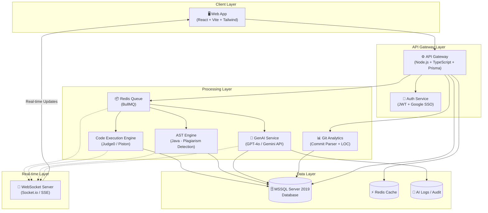

### 2.3. Core Subsystems
| # | Subsystem | Description | Key Technology |
|---|---|---|---|
| 1 | Portal & Auth | User interface, authentication, authorization | React, Vite, Tailwind, JWT, Google OAuth 2.0 |
| 2 | Code Execution Engine | Automated code grading in isolated sandbox | Judge0 API, Node.js |
| 3 | GenAI Core & Review Hub | Assignment generation, Clean Code grading, error explanation | OpenAI GPT-4o / Gemini API, LangChain |
| 4 | AST Plagiarism Detection | Source code plagiarism detection using AST + Winnowing | ANTLR4 (Java grammar), FastAPI wrapper |
| 5 | Redis Queue & Git Analytics | Background processing queue, team contribution analysis | BullMQ, Redis, Git CLI Parser |

---

## 3. System Actors

### 3.1. Actor Diagram

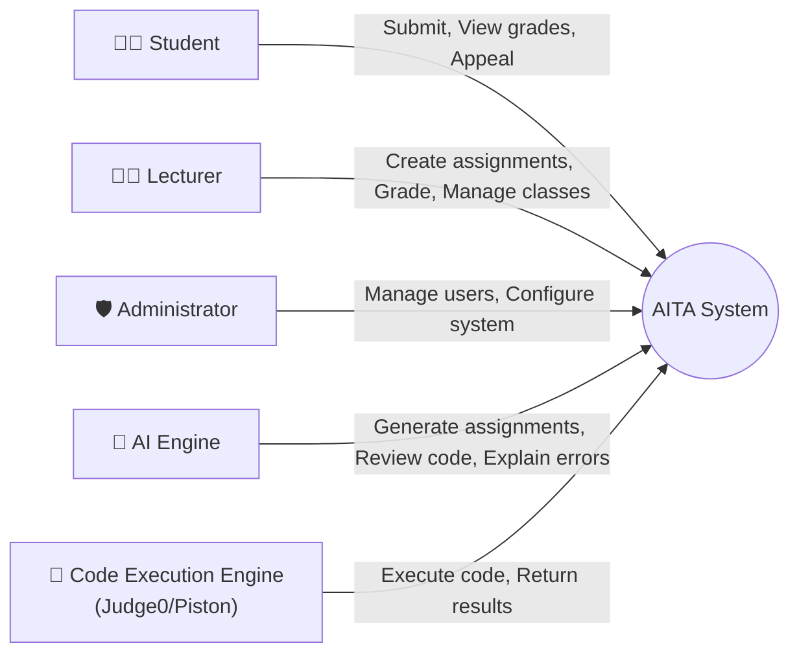

### 3.2. Detailed Actor Descriptions

| Actor | Role | Key Permissions |
|---|---|---|
| **Student** | Students use the system to submit assignments, view grading results, and appeal if they disagree with the outcome | SSO login (@fpt.edu.vn), view assignment list, upload .zip file, view real-time results, submit appeal |
| **Lecturer** | Lecturers create classes, design exams, manage grading rubrics, monitor results, and handle complaints | Create/edit/delete classes, import student lists from Excel, create assignments + test cases, request AI-generated assignments/rubrics, view statistical reports, handle appeals, view Git Analytics |
| **Administrator** | System administrators manage accounts, configure Sandbox settings, and monitor system operations | Manage users, configure Sandbox (RAM, CPU limits), manage API keys (OpenAI/Gemini), view audit logs |
| **AI Engine** | Automated system actor – Not a human. Performs content generation and code quality evaluation tasks | Generate assignments from lecturer descriptions, generate rubrics, evaluate Clean Code (SOLID, naming, architecture), explain compilation errors in natural language |
| **Code Execution Engine** | Automated system actor. An isolated runtime that executes student-submitted source code | Gửi request tới Judge0/Piston API, nhận kết quả compile/run, timeout enforcement ở tầng gọi API |

---

## 4. User Stories

### 4.1. Student Features

| ID | User Story | Acceptance Criteria | Priority |
|---|---|---|---|
| **US-01** | As a **student**, I want to **log in using my FPT Google account** (`@fpt.edu.vn` / `@fe.edu.vn`) so I don't need to create a new account and my identity is verified. | - Only accept FPT domain emails - Redirect to Dashboard after login - JWT stored in HttpOnly Cookie | 🔴 High |
| **US-02** | As a **student**, I want to **view the list of Assignments** for my enrolled class, so I can track deadlines and submission status. | - Display assignment name, deadline, status (Not submitted / Submitted / Graded) - Sort by nearest deadline | 🔴 High |
| **US-03** | As a **student**, I want to **submit assignments as a .zip file** containing source code, so the system can automatically grade them for me. | - Only accept .zip files (max 10MB) - File hashed with SHA-256 for integrity verification - System displays "Submission received" immediately | 🔴 High |
| **US-04** | As a **student**, I want to **view grading results in real-time** (test case scores, Clean Code score, plagiarism check results) as soon as the system finishes processing, without needing to reload the page. | - Real-time updates via WebSocket - Clearly display: Passed/Failed for each test case - Display Clean Code score with AI explanation - Display plagiarism similarity percentage (0-30% Safe, 30-60% Warning, >60% Danger/Flag) | 🔴 High |
| **US-05** | As a **student**, I want to **submit an Appeal** if I believe the automated grading result is inaccurate, so the lecturer can re-evaluate. | - Appeal form with "Reason" field (textarea) - Appeal status: Pending / Accepted / Rejected - Student receives notification when lecturer responds | 🟡 Medium |

### 4.2. Lecturer Features

| ID | User Story | Acceptance Criteria | Priority |
|---|---|---|---|
| **US-06** | As a **lecturer**, I want to **create a new class and import student lists from an Excel file**, to save time on manual data entry. | - Upload .xlsx file, system auto-parses columns: Student ID, Full Name, Email - Use DB Transaction to ensure full import or rollback on error - Report successful/failed import counts | 🔴 High |
| **US-07** | As a **lecturer**, I want to **create Assignments with test cases** (StdIn/StdOut format), so the system can automatically grade student submissions. | - Input title, description, deadline - Add multiple test cases (each with: Input, Expected Output, score weight) - Select programming language for Sandbox (Java, Python, C#) | 🔴 High |
| **US-08** | *(Simplified – MVP)* As a **lecturer**, I want to **request AI to generate a basic assignment draft** from my brief description, to reduce assignment preparation time. | - Lecturer enters a prompt describing the topic (e.g., "Assignment on linked list") - AI returns: basic assignment description and sample test cases - Lecturer must review and finalize before saving - *MVP Note: Full rubric auto-generation is a stretch goal* | 🟡 Medium |
| **US-09** | As a **lecturer**, I want to **view a Dashboard with overview statistics** (submission rate, score distribution, plagiarism suspects) for each assignment, to quickly assess class performance. | - Pie chart: submission rate - Bar chart: score distribution - Table: Top 10 submission pairs with highest similarity % (AST Plagiarism) | 🔴 High |
| **US-10** | As a **lecturer**, I want to **handle student appeals** (Accept or Reject with reason), to ensure fairness in grading. | - List of Pending appeals - Review code + original grading results - Accept (re-grade) or Reject (with reason) button | 🟡 Medium |
| **US-11** | *(Simplified – MVP)* As a **lecturer**, I want to **view basic Git Analytics** for each team member (commits, LOC), to get a high-level view of individual contributions. | - Input GitHub Repo URL of the team - Display: Total commits, LOC added/removed per member - *MVP Note: PR analysis and contribution timeline charts are planned for future iterations* | 🟡 Medium |

### 4.3. System / AI / Code Execution Features

| ID | User Story | Acceptance Criteria | Priority |
|---|---|---|---|
| **US-12** | As the **system**, when receiving a .zip submission file, I must **enqueue the submission into Redis (BullMQ)** for asynchronous processing, to avoid blocking the main API thread. | - Submission enqueued with metadata: submissionId, studentId, language - Queue has retry mechanism (max 3 retries) on job failure - API immediately returns status 202 Accepted | 🔴 High |
| **US-13** | As the **Code Execution Engine**, when receiving a job from Redis Queue, I must **execute student code in an isolated sandbox** (using Judge0/Piston) with limits: 512MB RAM, limited CPU, **disabled network access**, run with test cases, then return results. | - Sandbox auto-cleans after completion or timeout (30 seconds) - Judge0/Piston handles: process isolation, resource limiting, security - Return results: Passed/Failed for each test case + stdout/stderr | 🔴 High |
| **US-14** | As the **AST Engine system**, after code execution finishes, I must **convert source code to an AST, remove surface-level disguises** (variable names, comments, function order), **apply Winnowing** to create fingerprints, and **compare against all other submissions** in the same assignment to calculate similarity %. | - **Primary language: Java** (ANTLR parser) - *Python/C# support planned for future iterations* - Remove: variable names, function names, comments, whitespace, function order - Winnowing: k-gram size = 25, window size = 40 - Store fingerprints in `ASTFingerprints` table - Create Similarity Matrix: all submission pairs | 🔴 High |
| **US-15** | As the **AI system (LLM)**, after the Code Execution Engine finishes grading, I must **evaluate source code quality** (Clean Code, SOLID, naming convention, layer architecture) and **explain compilation errors in Vietnamese natural language** so students can understand. | - Use GPT-4o or Gemini API (exponential backoff retry) - Chain-of-Thought + Few-Shot Learning prompts - Return: Clean Code score (0-100), specific comments per file, compilation error explanation if any - Timeout: max 60 seconds/request | 🟡 Medium |

---

## 5. Detailed Use Case Specifications

### UC-01: Student Submits Assignment (Submit Assignment)
| Attribute | Description |
|---|---|
| **Primary Actor** | Student |
| **Secondary Actors** | Code Execution Engine, AST Engine, AI Engine |
| **Preconditions** | Student is logged in, Assignment deadline has not passed |
| **Main Flow** | 1. Student selects Assignment from the list 2. Student uploads `.zip` file containing source code 3. System validates file (checks size ≤ 10MB, .zip format) 4. System hashes file with SHA-256 for integrity verification 5. System creates `Submission` record with `PENDING` status 6. System pushes job to Redis Queue (BullMQ) 7. Redis Queue dispatches job to Worker 8. Code Execution Engine gửi submission tới Judge0 API, nhận kết quả test case 9. System updates status to `GRADING` 10. AST Engine parses source code, creates fingerprint, checks for plagiarism 11. AI Engine evaluates Clean Code + explains errors 12. System aggregates final score, updates status to `COMPLETED` 13. Sends real-time results to Student via WebSocket |
| **Alternative Flow** | **4a.** File is corrupt or exceeds size limit → Display error, request resubmission **8a.** Student code contains malware (fork bomb) → Timeout enforcement ở tầng gọi API → Status `SECURITY_VIOLATION` **8b.** Code fails to compile → Return compilation error + AI error explanation **10a.** Similarity detected > 60% → Flag as `PLAGIARISM_DETECTED`, notify lecturer |
| **Exception Flow** | **7a.** Redis Queue is full or down → System retries 3 times, if still failing → Status `QUEUE_ERROR`, notify Admin **11a.** OpenAI/Gemini API timeout → Skip Clean Code score, grade based on test cases + AST, mark "AI Review Pending" |
| **Postconditions** | `Submission` record is updated with final status and score. Student receives results on the interface. |

---

### UC-02: Lecturer Creates Assignment with AI (Create Assignment with AI)
| Attribute | Description |
|---|---|
| **Primary Actor** | Lecturer |
| **Secondary Actors** | AI Engine |
| **Preconditions** | Lecturer is logged in, has created at least 1 class |
| **Main Flow** | 1. Lecturer selects class and clicks "Create New Assignment" 2. Lecturer enters: Title, General Description, Programming Language, Deadline 3. (Optional) Lecturer clicks "Generate with AI": enters a topic description prompt 4. AI Engine returns: Detailed assignment, sample Input/Output, Grading Rubric 5. Lecturer reviews and edits AI-generated content 6. Lecturer adds Test Cases (StdIn → Expected StdOut) manually or from AI 7. Lecturer clicks "Save & Publish" 8. System creates Assignment record, sends notification to all students in the class |
| **Alternative Flow** | **3a.** Lecturer doesn't use AI → Manually enters the entire assignment **4a.** AI returns unsuitable results → Lecturer clicks "Regenerate" with a different prompt **6a.** Test cases are invalid (Expected Output is empty) → System warns and requests correction |
| **Postconditions** | Assignment is created and displayed in the class assignment list. |

---

### UC-03: Lecturer Imports Student List (Bulk Import Students)
| Attribute | Description |
|---|---|
| **Primary Actor** | Lecturer |
| **Preconditions** | Lecturer has created a class, has a properly formatted Excel file |
| **Main Flow** | 1. Lecturer selects class, clicks "Import Students" 2. Lecturer uploads `.xlsx` file 3. System parses file, extracts: Student ID, Full Name, Email 4. System displays preview list (for lecturer to verify) 5. Lecturer clicks "Confirm Import" 6. System uses **SQL Transaction** to insert all students 7. Displays results: X students successful, Y duplicate records |
| **Alternative Flow** | **3a.** Excel file has wrong format (missing columns) → Display detailed error, request re-upload **6a.** Transaction fails (e.g., duplicate email) → Rollback entirely, report specific duplicate rows |
| **Postconditions** | Student list is added to the class. New accounts are created (if not already existing). |

---

## 6. UML Diagrams

### 6.1. Use Case Diagram (Overview)

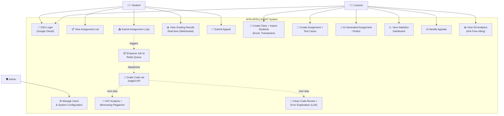

### 6.2. Activity Diagram – Submission and Automated Grading Flow

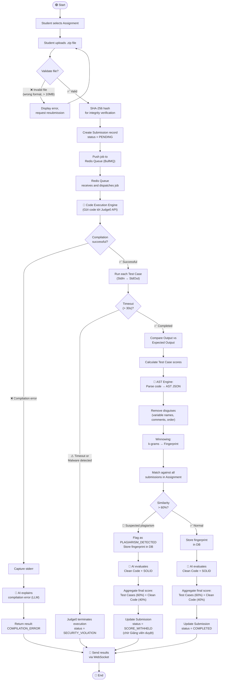

### 6.3. Sequence Diagram – Submission Grading API Flow

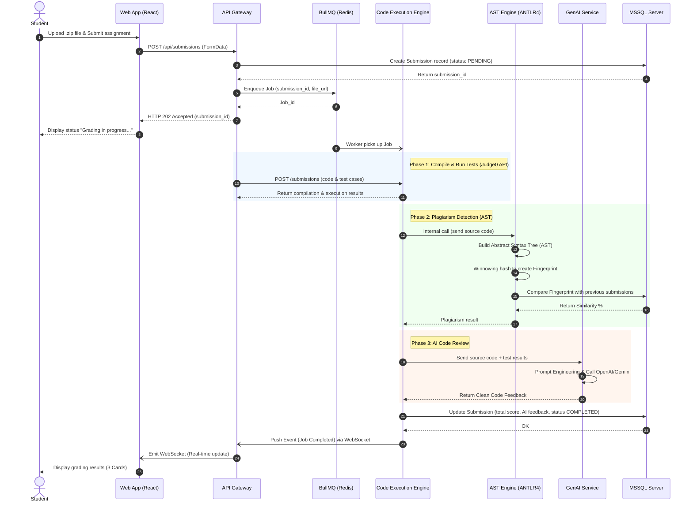

### 6.4. State Diagrams

#### 6.4.1. Submission Lifecycle

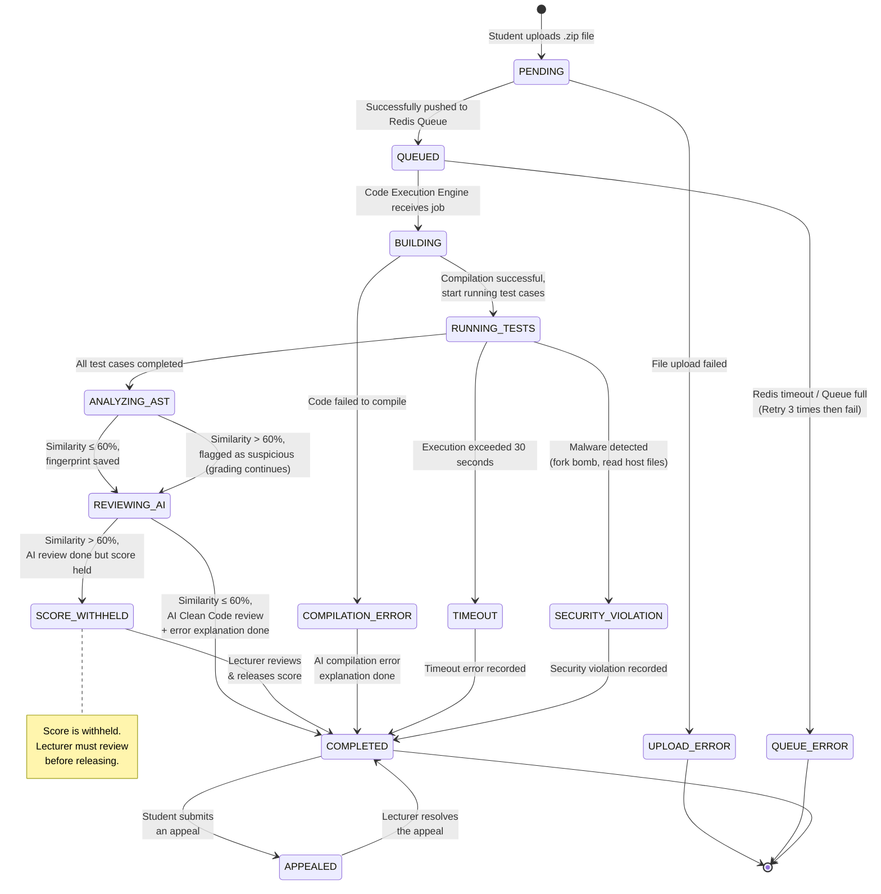

#### 6.4.2. GenAI Request Lifecycle
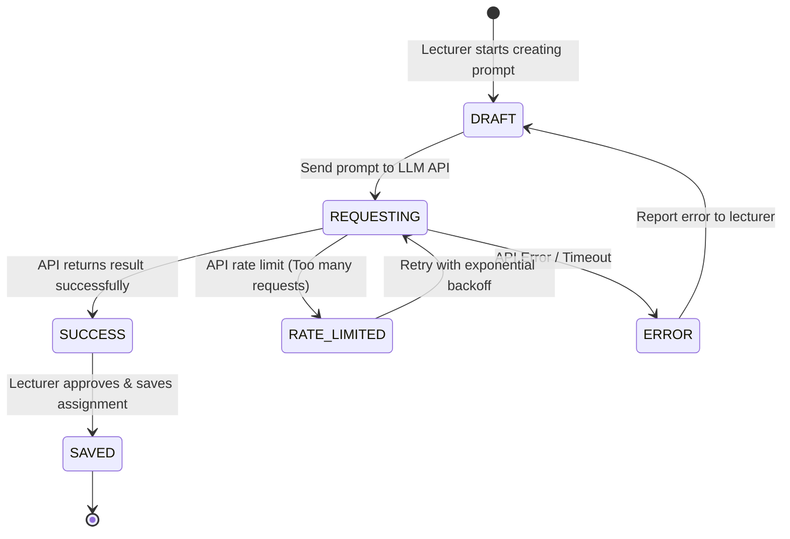

#### 6.4.3. Git Analytics Process Lifecycle
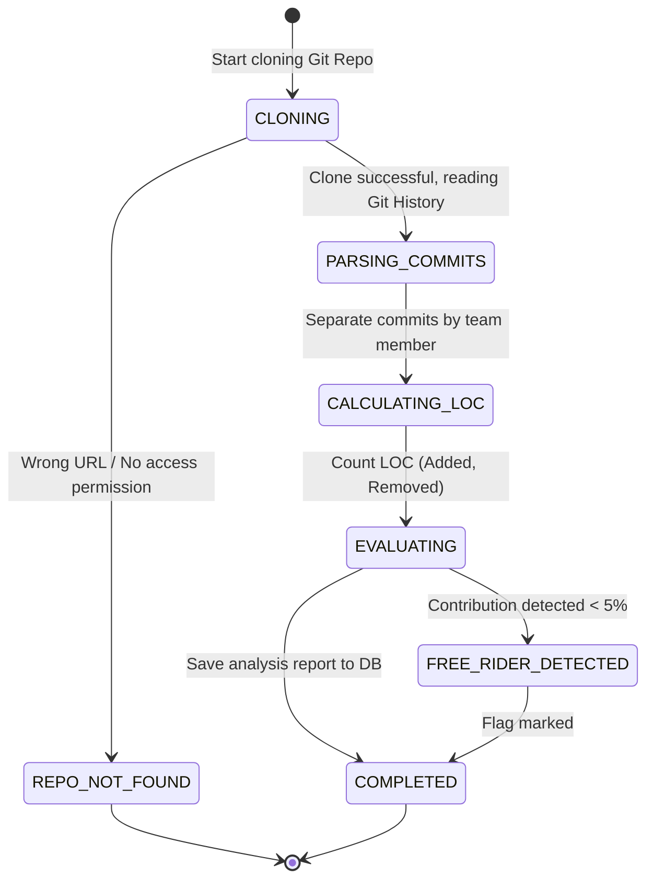

### 6.5. ERD (Entity-Relationship Diagram)

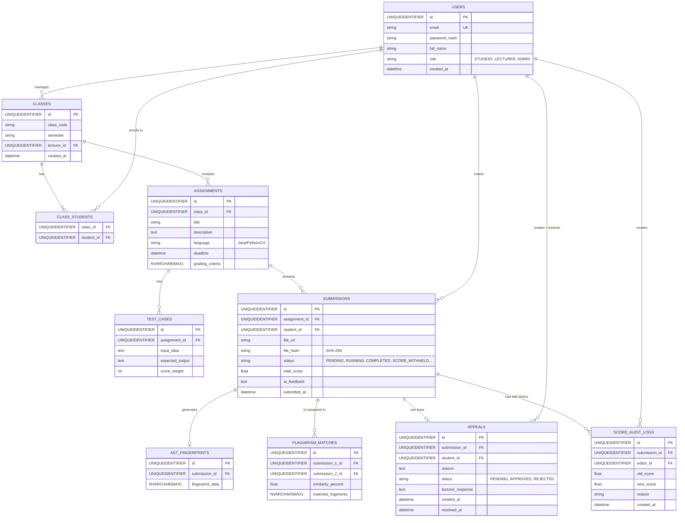

### 6.6. Data Dictionary

| Table | Column | Data Type | Constraints | Description |
|---|---|---|---|---|
| **USERS** | `id` | UNIQUEIDENTIFIER | PK | Primary key, user identifier |
| | `email` | VARCHAR(255) | UNIQUE, NOT NULL | FPT email for login |
| | `password_hash` | VARCHAR(255) | | Password (if using traditional login) |
| | `full_name` | VARCHAR(100) | NOT NULL | Full name |
| | `role` | VARCHAR (ENUM)| NOT NULL | Role: STUDENT, LECTURER, ADMIN (Mapped as string due to MSSQL limits) |
| **CLASSES** | `id` | UNIQUEIDENTIFIER | PK | Primary key, class identifier |
| | `class_code` | VARCHAR(50) | NOT NULL | Class code (e.g., SE1801) |
| | `lecturer_id` | UNIQUEIDENTIFIER | FK -> USERS(id) | Lecturer in charge of the class |
| **CLASS_STUDENTS**| `class_id` | UNIQUEIDENTIFIER | FK -> CLASSES(id) | Foreign key to class |
| | `student_id` | UNIQUEIDENTIFIER | FK -> USERS(id) | Foreign key to student |
| **ASSIGNMENTS** | `id` | UNIQUEIDENTIFIER | PK | Primary key, assignment identifier |
| | `class_id` | UNIQUEIDENTIFIER | FK -> CLASSES(id) | Foreign key to class |
| | `title` | VARCHAR(255) | NOT NULL | Assignment title |
| | `description` | TEXT | | Assignment description |
| | `language` | VARCHAR(20) | NOT NULL | Programming language for Sandbox (Java, Python, C#) |
| | `deadline` | TIMESTAMP | NOT NULL | Submission deadline |
| | `grading_criteria`| NVARCHAR(MAX) | | AI-generated grading criteria |
| **TEST_CASES** | `id` | UNIQUEIDENTIFIER | PK | Primary key, test case identifier |
| | `assignment_id` | UNIQUEIDENTIFIER | FK -> ASSIGNMENTS(id)| Belongs to which assignment |
| | `input_data` | TEXT | | Input (StdIn) |
| | `expected_output`| TEXT | | Expected output (StdOut) |
| | `score_weight` | INT | NOT NULL | Score weight |
| **SUBMISSIONS** | `id` | UNIQUEIDENTIFIER | PK | Primary key, submission identifier |
| | `assignment_id` | UNIQUEIDENTIFIER | FK -> ASSIGNMENTS(id)| Belongs to which assignment |
| | `student_id` | UNIQUEIDENTIFIER | FK -> USERS(id) | Submitter |
| | `file_url` | VARCHAR(255) | NOT NULL | File link .zip (S3/Local) |
| | `file_hash` | VARCHAR(64) | | SHA-256 for integrity verification |
| | `status` | VARCHAR (ENUM)| NOT NULL | Status (PENDING, QUEUED...) (Mapped as string due to MSSQL limits) |
| | `total_score` | FLOAT | | Total score |
| | `ai_feedback` | TEXT | | AI Clean Code feedback |
| | `submitted_at` | TIMESTAMP | DEFAULT NOW() | Date and time of submission |
| **AST_FINGERPRINTS**| `id` | UNIQUEIDENTIFIER | PK | Primary key, AST fingerprint identifier |
| | `submission_id` | UNIQUEIDENTIFIER | FK -> SUBMISSIONS(id)| Fingerprint of which submission |
| | `fingerprint_data`| NVARCHAR(MAX) | NOT NULL | Winnowing k-gram hash array |
| **PLAGIARISM_MATCHES**| `id` | UNIQUEIDENTIFIER | PK | Primary key, match identifier |
| | `submission_1_id` | UNIQUEIDENTIFIER | FK -> SUBMISSIONS(id)| First submission |
| | `submission_2_id` | UNIQUEIDENTIFIER | FK -> SUBMISSIONS(id)| Second submission |
| | `similarity_percent`| FLOAT | NOT NULL | Percentage of similarity (0-100) |
| | `matched_fragments` | NVARCHAR(MAX) | | Array of matching line numbers/blocks |
| **APPEALS** | `id` | UNIQUEIDENTIFIER | PK | Primary key, appeal identifier |
| | `submission_id` | UNIQUEIDENTIFIER | FK -> SUBMISSIONS(id)| Appeal for which submission |
| | `student_id` | UNIQUEIDENTIFIER | FK -> USERS(id)| Foreign key to student |
| | `reason` | TEXT | NOT NULL | Student's appeal reason |
| | `status` | ENUM | DEFAULT 'PENDING' | Status (PENDING, APPROVED, REJECTED) |
| | `lecturer_response`| TEXT | | Lecturer's response |
| | `created_at` | TIMESTAMP | DEFAULT NOW() | Timestamp of creation |
| | `resolved_at` | TIMESTAMP | | Timestamp of resolution |
| **SCORE_AUDIT_LOGS** | `id` | UNIQUEIDENTIFIER | PK | Primary key, log identifier |
| | `submission_id` | UNIQUEIDENTIFIER | FK -> SUBMISSIONS(id)| Affected submission |
| | `editor_id` | UNIQUEIDENTIFIER | FK -> USERS(id) | Who made the edit |
| | `old_score` | FLOAT | | Previous score |
| | `new_score` | FLOAT | | Updated score |
| | `reason` | TEXT | NOT NULL | Reason for score change |
| | `created_at` | TIMESTAMP | DEFAULT NOW() | Timestamp of edit |

### 6.7. UI Wireframes & Screen Flow

This section describes the key screens of the AITA-Intelligent system, their layout, components, and the navigation flow between them.

#### 6.7.1. Screen 1 — Login Page (Google SSO)

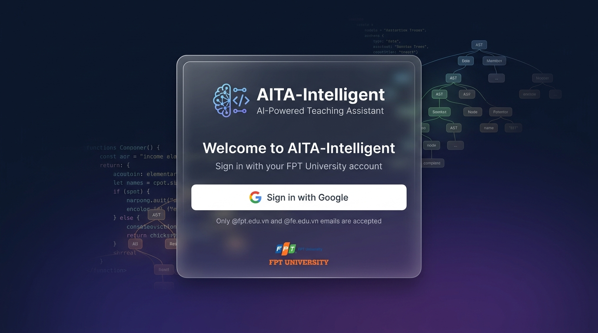

| Attribute | Description |
|---|---|
| **URL** | `/login` |
| **Layout** | Centered card on gradient background |
| **Components** | FPT University logo, Application title "AITA-Intelligent", "Sign in with Google" button (primary CTA), Footer with version info |
| **Actions** | Click "Sign in with Google" → Google OAuth 2.0 consent screen → Redirect to `/dashboard` on success |
| **Validation** | Only `@fpt.edu.vn` and `@fe.edu.vn` email domains accepted. Others shown error toast. |

#### 6.7.2. Screen 2 — Student Dashboard

| Attribute | Description |
|---|---|
| **URL** | `/dashboard` (role: Student) |
| **Layout** | Top navbar (avatar, notifications, logout) + Main content area with assignment cards |
| **Components** | - **Assignment Cards:** Title, Class code, Deadline countdown, Status badge (Not Submitted / Submitted / Graded) - **Sort/Filter:** By deadline (nearest first), by status - **Quick Stats bar:** Total assignments, Submitted count, Average score |
| **Actions** | Click card → Navigate to `/assignments/:id/submit` Click graded card → Navigate to `/submissions/:id/results` |
| **Real-time** | WebSocket listens for grading completion events → Status badge auto-updates without page reload |

#### 6.7.3. Screen 3 — Submission & Grading Results

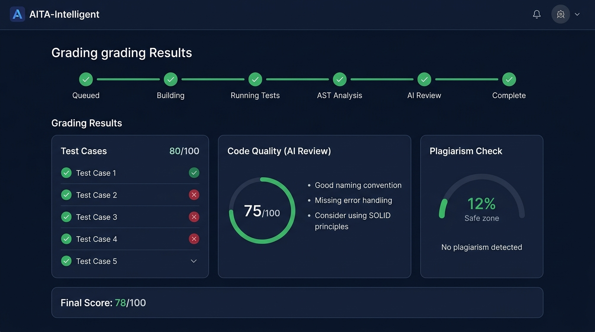

| Attribute | Description |
|---|---|
| **URL** | `/submissions/:id/results` |
| **Layout** | Progress stepper (top) + 3 result cards (horizontal row) + Final score bar (bottom) |
| **Components** | |
| *Progress Stepper* | 6 steps: Queued → Building → Running Tests → AST Analysis → AI Review → Complete. Active step: yellow spinner. Completed: green checkmark. |
| *Card 1: Test Cases* | Title + score (e.g., 80/100). List of test cases with ✅ (passed) / ❌ (failed). Expandable: Input, Expected Output, Actual Output. |
| *Card 2: Code Quality (AI Review)* | Circular gauge (0-100). AI feedback list: "✅ Good naming convention", "⚠️ Missing error handling", "💡 Consider SOLID principles". |
| *Card 3: Plagiarism Check* | Semicircle gauge with color zones: 0-30% green (Safe), 30-60% yellow (Warning), 60-100% red (Danger). Match details if flagged. |
| *Final Score Bar* | "Final Score: XX/100" (large font). Nếu trạng thái là SCORE_WITHHELD, hiện "Điểm đang chờ giảng viên duyệt do nghi vấn đạo văn". "Appeal this result" button if student disagrees. |
| **Real-time** | WebSocket connection pushes step-by-step progress updates. All 3 cards render simultaneously on "Complete". |

#### 6.7.4. Screen 4 — Lecturer Dashboard

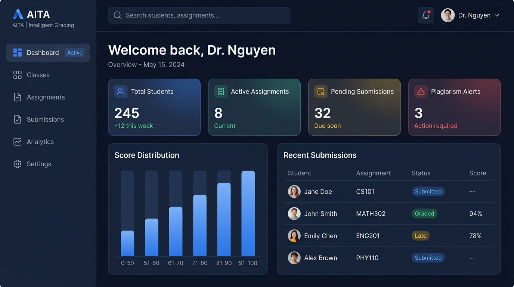

| Attribute | Description |
|---|---|
| **URL** | `/dashboard` (role: Lecturer) |
| **Layout** | Sidebar navigation + Main content with stats cards and data tables |
| **Components** | |
| *Sidebar* | Class list, Create Assignment, Import Students, Git Analytics, Appeals, Settings |
| *Stats Cards (top row)* | Total Students, Submissions Today, Average Score, Pending Appeals |
| *Submission Rate Chart* | Pie chart: Submitted vs Not Submitted vs Late |
| *Score Distribution Chart* | Bar chart: score ranges (0-20, 20-40, 40-60, 60-80, 80-100) |
| *Plagiarism Suspects Table* | Top 10 submission pairs with highest AST similarity %, with "View Detail" link |
| **Actions** | Click "Create Assignment" → `/assignments/new` Click "Import Students" → Upload modal Click student row → Detailed submission view |

#### 6.7.5. Screen Flow Diagram

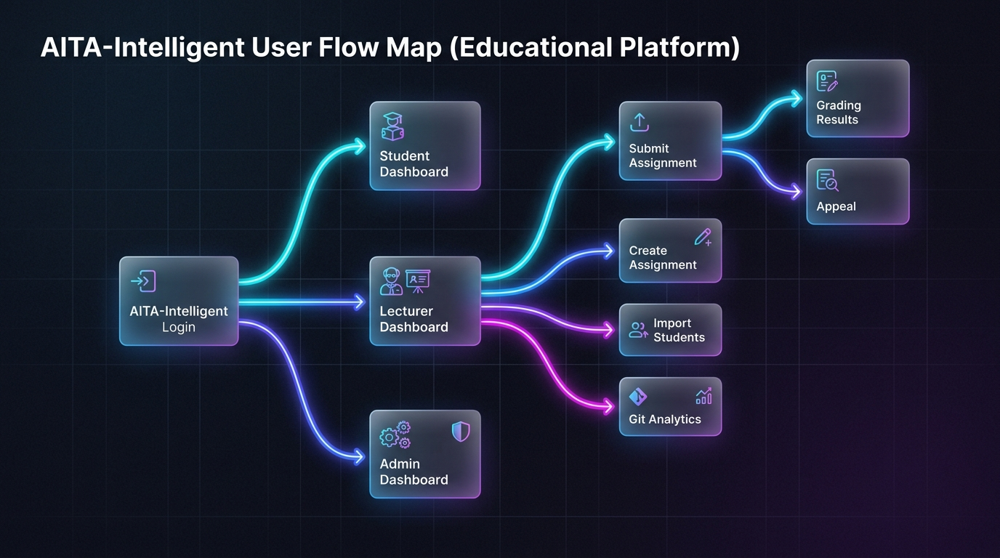

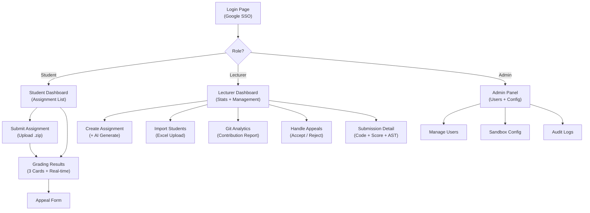

---

## 7. Non-Functional Requirements

### 7.1. Security

| ID | Requirement | Measurement Criteria |
|---|---|---|
| **NFR-01** | Code Execution Engine (Judge0/Piston) must completely isolate resources | RAM ≤ 512MB, limited CPU shares, **external network 100% disabled** (provided by Judge0/Piston out-of-the-box) |
| **NFR-02** | Execution sandbox must defend against common malware | Block: fork bomb, symlink escape, /proc mount, disk exhaustion (Judge0/Piston handles natively) |
| **NFR-03** | JWT authentication must be stored in HttpOnly Cookie | Cookie inaccessible from JavaScript (XSS prevention) |
| **NFR-04** | Google SSO must only accept FPT email domains | Whitelist: `@fpt.edu.vn`, `@fe.edu.vn` |
| **NFR-05** | API keys (OpenAI, Gemini) must not be hard-coded | Store in environment variables (.env), never commit to Git |
| **NFR-18** | **(P2P Defense)** System must log every sandbox execution in detail | Log includes: `submission_id`, `start_time`, `end_time`, `exit_code`, `resource_usage` (RAM/CPU peak), `security_alert`. Retain for minimum 30 days. |

### 7.2. Performance

| ID | Requirement | Measurement Criteria |
|---|---|---|
| **NFR-06** | Average API response time | ≤ 200ms for standard APIs (CRUD) |
| **NFR-07** | End-to-end grading time per submission | ≤ 90 seconds (includes: Code Execution + AST + AI). *Ghi chú: Giới hạn 30s áp dụng cho bước thực thi code trong Sandbox; 90s là tổng thời gian toàn bộ pipeline.* |
| **NFR-08** | System must handle concurrent load | ≥ 100 requests/minute (stress test with k6 or JMeter) |
| **NFR-09** | Grading results must be cached | Redis cache for result APIs, TTL = 5 minutes, response ≤ 100ms |

### 7.3. Scalability

| ID | Requirement | Measurement Criteria |
|---|---|---|
| **NFR-10** | Redis Queue must support batch grading | Process ≥ 50 concurrent submissions without blocking API gateway |
| **NFR-11** | System must support adding new programming languages | Configure new language ID in Judge0 API + add ANTLR grammar for AST support |

### 7.4. Reliability

| ID | Requirement | Measurement Criteria |
|---|---|---|
| **NFR-12** | Bulk student import must use DB Transaction | Import all successfully OR rollback entirely (ACID) |
| **NFR-13** | Redis Queue must have retry mechanism | Max 3 retries with exponential backoff |
| **NFR-14** | Sandbox resources must be cleaned after completion | Judge0 API handles process isolation and cleanup; system verifies via status polling |

### 7.5. Usability

| ID | Requirement | Measurement Criteria |
|---|---|---|
| **NFR-15** | Responsive interface on both Web and Mobile | Support: Desktop (≥ 1024px), Tablet (≥ 768px), Mobile (≥ 375px) |
| **NFR-16** | Real-time result updates without page reload | Using WebSocket (Socket.IO) with API polling fallback |
| **NFR-17** | Compilation error explanations in Vietnamese | AI returns explanations in Vietnamese natural language |

---

## 8. System Constraints

### 8.1. Technology Constraints
- **Frontend Web:** React 18+ with Vite, TailwindCSS
- **Backend:** Node.js 20+ with TypeScript, Prisma ORM
- **AST Engine:** Python 3.11+ with FastAPI, ANTLR4 (`antlr4-python3-runtime` for Java grammar)
- **Database:** Microsoft SQL Server 2019+
- **Message Queue:** Redis 7+ with BullMQ
- **Code Execution:** Judge0 / Piston (self-hosted or API)
- **CI/CD:** GitHub Actions
- **Cloud Deploy:** Azure / AWS / Vercel (team's choice)

### 8.2. MVP Scope Limitations
> The following features are scoped as **simplified/secondary** for the 10-week MVP. Full implementations are planned for future iterations.

| Feature | MVP Scope | Future Scope |
|---|---|---|
| **AST Plagiarism Detection** | Java only (ANTLR parser) | Add Python (`ast` module), C# (Roslyn) |
| **GenAI Assignment Generation (US-08)** | Basic draft generation (assignment description + sample test cases) | Full rubric auto-generation, multi-round refinement |
| **Git Analytics (US-11)** | Basic metrics: commits count, LOC per member | PR analysis, contribution timeline charts, automated free-rider scoring |
| **Code Execution Engine** | Use Judge0/Piston API (pre-built sandbox) | Custom Docker containers with fine-grained resource control |
| **Mobile App** | Responsive web (PWA-ready) | Native React Native / Expo app |

### 8.3. Risk Assessment

| # | Risk | Impact | Mitigation |
|---|---|---|---|
| R-01 | **Resubmission Policy** — No clear rule on how many times a student can resubmit before deadline | Students may flood the queue with unlimited resubmissions | Limit to max 5 submissions per assignment per student. Show remaining attempts on UI. |
| R-02 | **API Rate Limiting** — OpenAI/Gemini API may throttle or reject requests during peak hours | AI Code Review step fails, resulting in incomplete grading | Implement queue-based retry with exponential backoff. Fallback: skip AI review and mark as "AI Review Pending". |
| R-03 | **Audit Trail for Manual Edits** — Lecturer manually overrides a score but no log is kept | Disputes during P2P Defense cannot be resolved with evidence | Log every manual score edit: `editor_id`, `old_score`, `new_score`, `reason`, `timestamp`. Immutable audit table. |
| R-04 | **False-Positive Plagiarism** — AST + Winnowing flags legitimate code as plagiarism (e.g., boilerplate, starter code) | Students unfairly penalized, appeals increase | Allow lecturer to whitelist specific code patterns/files. Display similarity breakdown (which functions matched). Student can appeal with explanation. |
| R-05 | **Data Retention Policy** — No defined policy for how long submission files, logs, and personal data are stored | GDPR/PDPA compliance risk, storage costs grow unbounded | Define retention: Submission files = 1 semester, Sandbox logs = 30 days (NFR-18), Personal data = until account deletion. Auto-purge scripts run monthly. |

### 8.4. Business Constraints
- The system only serves students and lecturers belonging to FPT University (verified by email domain).
- Each submission is limited to a maximum of 10MB (.zip file).
- Maximum code execution time is 30 seconds per submission (enforced by Judge0 API timeout).
- OpenAI/Gemini API key uses a single key with exponential backoff retry.

### 8.5. Project Constraints
- Development timeline: 10 weeks.
- Development team: 4-6 students.
- Code must pass linting (ESLint/Prettier for TypeScript, Flake8 for Python).
- Unit test coverage ≥ 80% on core modules (scoring, validation, matching logic - excluding live Judge0/AI integration paths).

---

**End of SRS Document – Version 1.2 (Updated per Milestone 1 Feedback + Contradiction Fix)**
**Development Team: SWP391 – Group 3**
